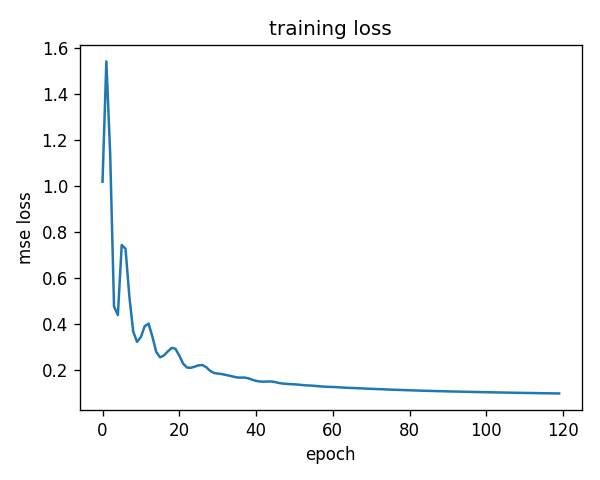
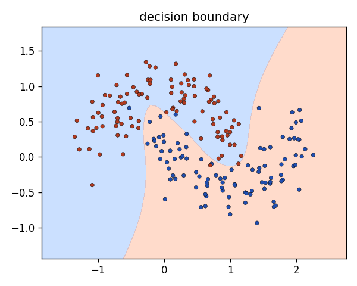

# tiny-autograd

building a small autograd engine from scratch so i actually understand how
backprop works instead of just calling `loss.backward()`.

inspired by micrograd, but i'm extending it with a numpy tensor engine and
checking the gradients more carefully than a tutorial usually does.

## the claim i'm trying to prove

> every gradient my engine computes matches both central finite-differences and
> PyTorch autograd to within a tiny tolerance, and a neural net built on top of
> it trains on a real toy dataset.

two independent checks matter here: finite-differences and PyTorch fail in
different ways, so if my gradient agrees with both, it's probably right.

## what's inside

- `tinygrad_scratch/engine.py` - the scalar `Value` type + `backward()`
- `tinygrad_scratch/nn.py` - neurons, layers, an MLP, and a couple of losses
- `tinygrad_scratch/optim.py` - SGD, Momentum, Adam
- `tinygrad_scratch/tensor.py` - a numpy version with broadcasting
- `tests/` - per-op gradient checks, finite-diff, pytorch parity
- `scripts/` - train an MLP on two-moons

## running it

```bash
pip install -e .[dev]
pytest -q
```

## results so far

gradients vs pytorch (double precision), max difference over the test expressions:

| expression | max grad difference |
|---|---|
| mul / div / pow / sub | 0.0 |
| tanh, relu, exp | 0.0 |
| log, pow | 0.0 |

so the gradients agree with pytorch basically exactly (difference is zero up to
floating point), wich is what i was hoping for. the finite-difference check
agrees too, to about 1e-7.

### training a net with the engine

i train a small MLP (2 -> 16 -> 16 -> 1, tanh) on `make_moons` using my own
Adam, with mse loss. it reaches **0.985** accuracy on 200 points.

run it yourself:

```bash
python scripts/train_moons.py
python scripts/plot_results.py
```

loss going down and the boundary it learns:



